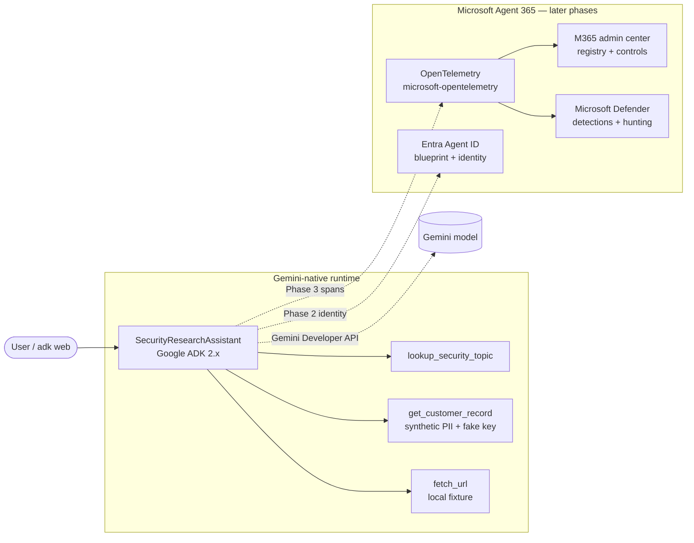

# Gemini-native agent in Microsoft Agent 365

A customer-facing lab that takes a **Gemini-native agent** (Google ADK 2.x, Gemini
model via the Gemini Developer API) and wraps it in **Microsoft Agent 365** for
telemetry, threat protection, and governance.

The agent stays Gemini-native throughout — the model is never swapped for another
backend. Microsoft capabilities are layered on around it.

> **Status:** Phase 0 (scaffold) and Phase 1 (baseline Gemini agent) are
> implemented. Later phases are documented in the build plan and added
> incrementally.
>
> **Branches (three iterations):** `main` = the **before** (baseline Gemini
> agent, zero Microsoft dependencies); `a365-integration` = the **S2S agent**
> (observability/threat/governance lab); a future branch = **AI Teammate** with
> Teams + Copilot delivery (OBO + Work IQ). See
> [docs/OPERATOR_NOTES.md](docs/OPERATOR_NOTES.md#branch-strategy--three-iterations).
>
> **Running this yourself?** Read [docs/OPERATOR_NOTES.md](docs/OPERATOR_NOTES.md)
> first — gotchas, secrets hygiene, and when to use Skills vs the CLI vs manual
> steps.

## Architecture



Telemetry (Phase 3) is the prerequisite for Defender detections (Phase 5): the
agent's OpenTelemetry spans flow into Agent 365 observability, which Defender
consumes.

## Prerequisites (Phase 0 / 1)

- macOS (Apple Silicon assumed), zsh, [Homebrew](https://brew.sh).
- Python 3.11+ and [uv](https://docs.astral.sh/uv/).
- A **Gemini API key** from [Google AI Studio](https://aistudio.google.com/)
  (free tier; a personal Google account is fine — no GCP project or billing).

```zsh
make setup                       # brew install uv gh azure-cli dotnet-sdk + uv sync
cp security_agent/.env.example security_agent/.env
# then edit security_agent/.env and set GOOGLE_API_KEY=...
```

## Run the baseline agent

```zsh
make run-web        # ADK Web UI (dev only) on http://localhost:8000
make run-cli        # one interactive CLI session (adk run)
make run-api        # programmatic server (adk api_server)
make test           # pytest smoke suite
```

**ADK Web is dev-only.** On macOS, if port 8000 is taken (AirPlay Receiver can
hold 5000/7000; other dev servers often hold 8000), use another port:

```zsh
make run-web PORT=8080
```

Run `make help` for the full target list.

## The agent

`SecurityResearchAssistant` (`security_agent/agent.py`) exposes three tools, each
with type hints and docstrings the model reads:

| Tool | Purpose |
| --- | --- |
| `lookup_security_topic` | Harmless reference lookup from a curated knowledge base. |
| `get_customer_record` | Returns a **synthetic** record with fake PII + a fake API key — bait for later Defender credential-leak / exfil detections. |
| `fetch_url` | Reads a **local fixture file** (never the open internet) — the Phase 5 indirect prompt-injection (XPIA) vector. |

All sensitive-looking values are synthetic and safe to run in a customer tenant.

## Security note

`attacks/private/` is git-ignored and holds operator-supplied adversarial
material that is **never committed** and **never executed by the agent** — only
the Phase 5 attack runner sends it. The agent starts clean every time so the demo
keeps a real before/after.

## Build plan (later phases)

| Phase | Deliverable |
| --- | --- |
| 2 | Register in Agent 365 ([Entra Agent ID blueprint + identity, S2S](docs/PHASE2_REGISTRATION.md)). |
| 3 | Observability — OpenTelemetry → Agent 365 ([telemetry contract](docs/TELEMETRY.md)). |
| 4 | Work IQ governed tooling (optional; needs OBO — see [DEFERRED.md](docs/DEFERRED.md)). |
| 5 | Threat protection — Microsoft Defender detections + Advanced Hunting (KQL). |
| 6 | Governance controls + **controls test matrix** (`docs/CONTROLS_TEST_MATRIX.md`). |
| 7 | Deploy to Vertex AI Agent Engine (**deferred** — [docs only](docs/DEFERRED.md)). |
| A | Purview DLP (**optional appendix** — docs only). |

## Licensing

This lab's source is under the repository `LICENSE`. Google ADK, `google-genai`,
and Microsoft packages retain their own licenses. Gemini API usage is subject to
Google's terms; Agent 365 / Defender / Entra features require the appropriate
Microsoft licenses (see the build plan's pre-flight checklist).
