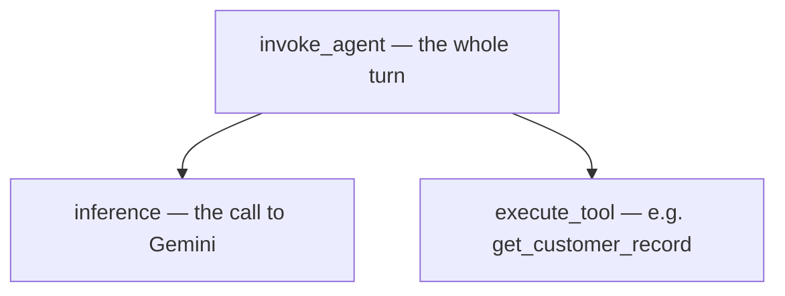
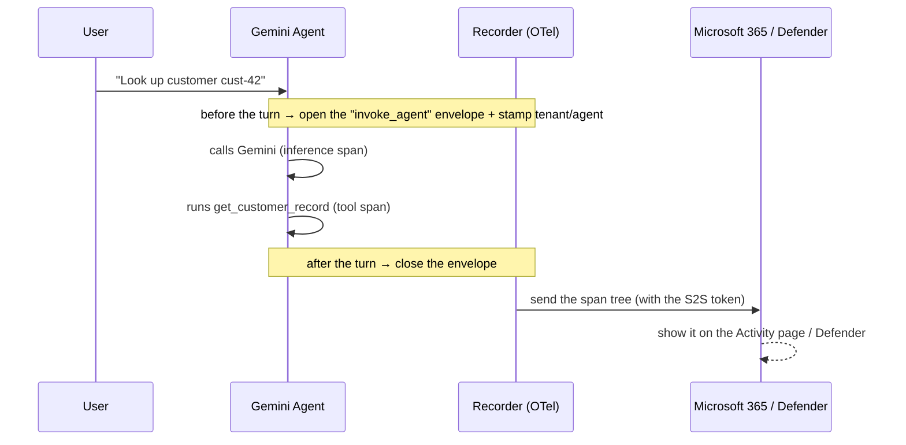

# How agent telemetry works (Agent 365 observability, in plain terms)

A non-technical walkthrough of what "Phase 3" does: it makes our Gemini agent
**report what it does** into Microsoft's security systems, so admins can see,
audit, and later protect it — even though the agent isn't a Microsoft product.

## The one-sentence version

Our Gemini agent now records every message, every AI call, and every tool it
runs, and ships that record to the Microsoft 365 admin center and Microsoft
Defender.

## The analogy: a badge + a body camera

Think of the agent as a **contractor working inside a company building**:

- **Registration (Phase 2)** gave the contractor an **ID badge** — Microsoft now
  knows *who* this agent is.
- **Telemetry (Phase 3)** adds a **body camera + activity log** — every door they
  open and action they take is recorded to the security office.

Without telemetry, the agent has a badge but is invisible once it starts working.

## What actually gets recorded

Every conversation turn produces a small tree of **"spans"** (a span = one timed
piece of work):

So *"look up customer cust-42"* becomes: **the turn** → **the AI thinking** →
**the tool it ran**. That tree is the audit trail. The industry-standard format
for it is called **OpenTelemetry**.

## The four moving parts

1. **The recorder** (`microsoft-opentelemetry`) — a library that watches the
   agent and produces the spans automatically. Turned on *before* the agent
   starts so it can hook into Gemini's calls.
2. **The envelope** (`InvokeAgentScope`) — Microsoft only accepts a trace wrapped
   in an official "an agent was invoked" envelope. We add it around each turn.
   **Without it, the data is silently ignored.**
3. **The name tag** (baggage) — each span is stamped with *which tenant* and
   *which agent* it belongs to, so Microsoft attributes it to our agent.
4. **The pass to send data** (the S2S token) — a valid access token proves the
   agent is allowed to ship telemetry.

## The flow of one message

## Why the token is a whole song-and-dance (S2S)

Our agent runs on its own with **no signed-in user** (a background service —
"S2S" = service-to-service). To prove it's allowed to send telemetry it does a
**3-step token exchange** ("FMI chain"):

> the **Blueprint's** credentials → swap for the **Agent Identity's** token →
> swap for a token scoped to the **Observability API**.

A background thread refreshes this every 50 minutes so a fresh pass is always
ready. We verified it works against the real tenant.

## Where it maps in the code

| Plain concept | File |
| --- | --- |
| Turn on the recorder before the agent loads | `security_agent/__init__.py` → `init_observability()` |
| Get + refresh the S2S token | `observability/observability_token_service.py` |
| Wrap each turn in the envelope + name tag | `observability/adk_instrumentation.py` |
| Who the agent "acts as" for reporting (the sponsor) | `observability/obs_context.py` |
| Prove it all works | `scripts/telemetry_check.py` → `make telemetry-check` |

## Two gotchas worth knowing

1. **The envelope is mandatory.** No `invoke_agent` wrapper → data dropped
   silently, even though everything "looks" fine. (Classic "why is my Activity
   page empty?")
2. **Licensing gate.** Even with perfect data, Microsoft only shows it if a
   tenant user has an **E7 / Agent 365 license**. No license → dropped silently.
   So "no errors" ≠ "it's showing up."

## Why anyone should care

Telemetry is the **foundation for threat protection**. Microsoft Defender doesn't
watch the agent directly — it watches this telemetry. Once the agent reports its
activity, Defender can spot **prompt injection, credential leaks, or tool abuse**
and raise alerts. **No telemetry, no threat detection** — which is why
observability comes before security.

> For the engineering-level contract (span attributes, Defender tables, env
> vars), see [TELEMETRY.md](TELEMETRY.md).
